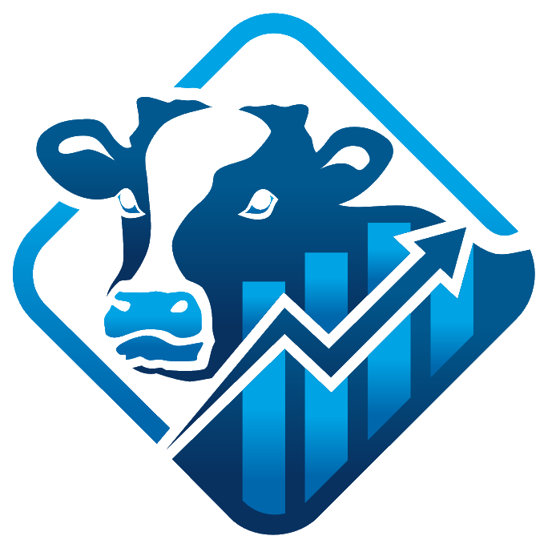

| {width="257"}  {width="79"} 

# Course

Digital Dairy Management and Data Analytics

Spring - 2027

Department of Animal Science, ANSCI 4940

## Instructor

-   Assoc. Prof. Dr. DVM Miel Hostens

-   Robert and Anne Everett Endowed Associate Professor

-   Office : 273 Morrison Hall, Ithaca, NY 14853

-   Email : [miel.hostens\@cornell.edu](mailto:miel.hostens@cornell.edu)

-   Office Hours: [Schedule an appointment](https://outlook.office.com/bookwithme/user/81c7a026deb04fc9a3c8251ceeb24e81@cornell.edu?anonymous&ep=signature)

## Teaching Assistants

### DVM Meike van Leerdam

-   Office location : B16 Morrison Hall, Ithaca, NY 14853

-   Email : [mbv32\@cornell.edu](mailto:mbv32@cornell.edu)

### DVM Sumit Sharma

-   Office location : B16 Morrison Hall, Ithaca, NY 14853

-   Email : [ss4452\@cornell.edu](mailto:ss4452@cornell.edu){.email}

# Overview

## Credits

This course accounts for **3 credits**.

## Description

This **3 credit course** introduces sophomore, junior, senior level undergraduate or graduate level students to the principles and applications of data analytics in modern dairy herd management. Students will learn how to collect, clean, analyze, and interpret farm-level data from the Cornell Dairy Research and Education Centre (CDREC). Through hands-on labs, students will apply statistical and computational tools to evaluate herd performance in key management areas, including nutrition, reproduction, animal health, and farm economics.

By the end of the course, students will integrate these data into a digital management framework and engage in a managerial decision-making exercise, including a SWOT analysis with farm stakeholders.

This course emphasizes data literacy, statistical reasoning, and ethical interpretation of agricultural data. It satisfies the **CALS Data Literacy (Statistics)** requirement by developing student competencies in data manipulation, analysis, interpretation, and communication within the context of dairy science.

## Aims

-   Provide students with knowledge and practical skills in the use of data for dairy herd management.
-   Train students in statistical and computational methods relevant to agricultural datasets
-   Encourage critical evaluation of data quality, limitations, and biases in animal production systems
-   Develop students’ ability to communicate data-driven insights to both scientific and farm management audiences

## Learning Outcomes

Upon successful completion, students will be able to:

1.  Collect, organize, and clean dairy farm datasets
2.  Apply statistical and computational methods (Excel, R, Python, etc.)
3.  Identify strengths, weaknesses, and limitations of data types
4.  Interpret and critique datasets in biological, economic, and management contexts
5.  Create visualizations and communicate insights ethically
6.  Synthesize data into a decision-support framework and contribute to a SWOT analysis

## Prerequisites

A statistics course is **not** required but **recommended**:

-   STSCI 2150/5150 Introductory Statistics for Biology
-   BTRY3010/STSCI2200 & BTRY5010/STSCI5200: Biological Statistics I
-   ILRST/STSCI 2100: Introductory Statistics

## Materials, Textbook and Website

All lecture notes, assignment instructions, an up-to-date schedule, and other course materials may be found on the course website at [Digital Dairy Management and Data Analytics](https://bovi-analytics.github.io/DigitalDairyManagementandDataAnalytics).

No official textbook but the following textbook is recommended:

-   [*Large Dairy Herd Management*](https://ldhm.adsa.org/)

Although I will try to avoid last minute changes to the schedule this might happen given this project oriented learning course. I will send course announcements via email.

## Topics and Outline

See [course website](https://bovi-analytics.github.io/DigitalDairyManagementandDataAnalytics/course-overview.html) for details as updates may occur during the semester given the project and data driven nature of the class.

| Week | Topic |
|:-----------------:|-----------------------------------------------------|
| 1 | Introductory multiple choice questions and inventory management |
| 1 | Syllabus Review and Introduction |
| 1 | (LAB ) CDREC Farm Tour & Presentation from farm manager |
| 2 | Principles of Data Collection |
| 2 | Principles of Data Visualization |
| 2 | (LAB) Effective visualization using Tableau |
| 3 | Understanding Milk Production Data (part 1) |
| 3 | Understanding Milk Production Data (part 2) |
| 3 | (LAB) Analyze CDREC Milk Production Records |
| 4 | Using Relationships and Joins Between Datasets |
| 4 | (LAB) Analyze CDREC Milk Production Records |
| 5 | February break (no class) |
| 5 | CDREC Project status discussion |
| 5 | (LAB) Analyze CDREC Milk Production Records |
| 6 | FAIR data principles for animal science |
| 6 | Inventory Management in Dairy Systems |
| 6 | (LAB) Inventory Calculations |
| 7 | Inventory Management in Dairy Systems |
| 8 | DISC Assessment & Team Dynamics |
| 8 | Midterm Prep: CDREC Data – Planning Phase I Presentation |
| 8 | (LAB) Midterm Presentation Prep: CDREC Data Discussion |
| 9 | Midterm Review: CDREC Data – Addressing Phase I Questions (Meeting & Presentation with CDREC Manager) |
| 9 | No class |
| 9 | (LAB) No Lab (Dairy Fellows Program) |
| 10 | Handling uncertainty in farm data |
| 10 | CDREC Data Discussion – Phase II: Questions from Initial Meeting |
| 10 | (LAB) CDREC Data Discussion – Phase II: Addressing Raised Questions |
| 10 | Spring Break (no class) |
| 10 | Spring Break (no class) |
| 11 | Discuss progress questions farm manager |
| 11 | Discuss progress questions farm manager |
| 11 | (LAB) discussion beef vs dairy semen |
| 12 | Discuss progress questions farm manager |
| 12 | Journal club heifer rearing |
| 13 | Discuss the dairy business summary 2025 |
| 13 | Benchmark CDREC vs dairy business summary |
| 13 | (LAB) Economical data deep dive and apply questions farm manager |
| 14 | Monitoring transition succes through data |
| 14 | Practice capstone meeting (Internal Peer Review) |
| 14 | (LAB) Finalize SWOT & Peer Feedback |
| 15 | Capstone Management Meeting & Course Wrap-Up |

## Format and Expectations

This course will consist of a combination of lectures, hands-on practical lab sessions, group discussions, and guest lectures from domain experts.

Students will have the opportunity to work with data from the Cornell Dairy Research and Education Centre (CDREC).

### General weekly format

| Day      | Time        | Activity             |
|----------|-------------|----------------------|
| Tuesday  | 10:10–11:00 | Lecture              |
| Thursday | 10:10–11:00 | Lecture / Discussion |
| Thursday | 13:25–16:25 | Lab / Project        |

### Lectures

The goal of the lectures is to have them as interactive as possible (which requires your attendance and participation). My role as instructor is to introduce you new tools and techniques, but it is up to you to take them and make use of them.

### Labs

Labs will use real-world datasets from the Cornell University Research Centre. Students will work individually and in teams to:

-   Work with herd management software across the different management domains.

-   Clean and curate datasets (Excel, R, Python and Tableau).

-   Conduct statistical analyses on herd-level data.

-   Develop visualizations, reports and presentations for practical decision-making.

-   Interact with students and herd managers to interpret results in a farm management context.

# Alignment with CALS Data Literacy (Statistics)

This course fulfills the Data Literacy: Statistics (DLS-AG) requirement by focusing on:

-   Data Manipulating & Analysis (primary competency): applying statistical methods to agricultural data.

-   Data Reading, Cleaning, Curating, Securing: preparing and standardizing raw dairy datasets.

-   Data Interpretation & Critique: understanding strengths, limitations, and biases in farm data.

-   Communicating & Arguing with Data: visualizing and presenting data ethically to support arguments.

At least 75% of course content is centered on these competencies, and Learning Outcomes 2, 3, 4, and 5 explicitly support them.

# Grading

## Practices and Policies

Grading in this course is centered on a collaborative, transparent evaluation process. At the beginning of the semester, students and the instructor will jointly define an “[A+ eligibility](https://bovi-analytics.github.io/DigitalDairyManagementandDataAnalytics/project-agreement.html)” checklist that outlines the standards for exceptional performance. Throughout the term, students will engage in structured peer evaluation, providing feedback on individual contributions and team outcomes in alignment with this agreed framework. An interim capstone management meeting will serve as a formal checkpoint to assess progress, address challenges, and recalibrate expectations. Final grades will be informed by peer evaluations, the extent to which the A+ criteria have been met, and performance during the final capstone presentation and review, ensuring that both process and outcomes are fairly recognized.

## Capstone Management Meeting

The course culminates in a capstone management meeting in which student teams present a comprehensive SWOT (Strengths, Weaknesses, Opportunities, and Threats) analysis of the Cornell Dairy Research and Education Centre to farm managers and invited stakeholders. Drawing on data from across the semester—including feeding, reproduction, health, and economics— students will synthesize their findings into a decision-support framework that highlights both current performance and future strategies for improvement. The meeting emphasizes not only technical accuracy and analytical depth but also clarity of communication, professional presentation, and the ability to translate complex datasets into actionable insights for practical dairy management. This exercise mirrors real-world decision-making processes and challenges students to engage directly with farm leaders in a professional, evidence-based dialogue, but within a safe environment of CDREC.

## Grading Distribution

| Component | Description | Weight |
|-------------------------|-----------------------------|------------------|
| Peer evaluation | Feedback on presentations and collaboration | 20% |
| Interim capstone management meeting | Interim assessment and presentation | 30% |
| Final capstone management meeting | SWOT analysis presentation and teamwork | 50% |

## Grade Scale

| Grade | Low   | High  |
|:------|:------|:------|
| A+    | 99.80 | 100.0 |
| A     | 93.33 | 99.80 |
| A-    | 90.00 | 93.33 |
| B+    | 86.66 | 90.00 |
| B     | 83.33 | 86.66 |
| B-    | 80.00 | 83.33 |
| C+    | 76.66 | 80.00 |
| C     | 73.33 | 76.66 |
| C-    | 70.00 | 73.33 |
| D+    | 66.66 | 70.00 |
| D     | 63.33 | 66.66 |
| D-    | 60.00 | 63.36 |
| F     | 0.00  | 60.00 |

Each grade range includes the score on the left, and excludes the score on the right. For example, a 90.0 is an A-, and not a B+. An 89.99 is a B+, not an A-.

# Course Management and Policies

## Course Attendance

Attendance is expected for all scheduled lectures. Students may miss up to two sessions without penalty, provided they review the material independently. Beginning with the third absence, each additional missed class will result in a deduction from the participation grade, and excessive absences may affect overall course performance. In cases of documented illness or exceptional circumstances, accommodations may be considered at the instructor’s discretion.

## Mental Health and Stress management

If you are feeling overwhelmed, or are worrying about a friend, please reach out to me, one of your instructors or your academic adviser. We can try to help, or we can put you in touch with someone who can help. Cornell has trained counselors available to listen and help: [Cornell Health's Counseling and Psychological Services](https://health.cornell.edu/services/counseling-psychiatry) (CAPS, 607-255-5155); [Student Support and Advocacy Services](https://scl.cornell.edu/student-support); [Empathy, Assistance, and Referral Service](http://orgsync.rso.cornell.edu/org/ears) (EARS, 213 Willard Straight Hall, 607-255-3277), and [Let’s Talk](https://health.cornell.edu/services/counseling-psychiatry/lets-talk). The [Learning Strategies Center](http://lsc.cornell.edu/) offers a range of academic resources.

## Inclusive Community

I grew up in a family in which values as diversity, equity and inclusion were at the core of our everyday life. My parents were both involved taking care of people struggling with equity and inclusion, and as a result these values are deeply embedded in my character.

I aim to ensure that students from all diverse backgrounds and perspectives are well-served by this course. I strive to address students’ learning needs both in and out of class, and to view the diversity that students bring as a resource, strength, and benefit. My goal is to present materials and activities that respect diversity and align with Cornell University’s core values. Sometimes it might fade during busy times, don't be afraid to recall someone, we're all humans after all. "*Your suggestions are truely encouraged and appreciated"*. Please let me know how I can improve the course’s effectiveness for you personally, or for other students or student groups.

Additionally, I aim to foster a learning environment that embraces a diversity of thoughts, perspectives, and experiences, and respects your identities. If your experiences outside of class are affecting your performance, please feel free to talk with me. Alternatively, your academic dean is a great resource if you prefer to speak with someone outside the course.

## Academic Integrity, Academic Freedom and Building Trust in the Classroom

Each student in this course is expected to abide by the Cornell University Code of Academic Integrity. Any work submitted by a student in this course for academic credit will be the student's own work.

Absolute integrity is expected of every Cornell student in all academic undertakings. Integrity entails a firm adherence to a set of values, and the values most essential to an academic community are grounded on the concept of honesty with respect to the intellectual efforts of oneself and others, and free and open inquiry and discussion in the classroom. Academic integrity is expected not only in formal coursework situations, but in all University relationships and interactions connected to the educational process, including the use of University resources. While both students and faculty of Cornell assume the responsibility of maintaining and furthering these values, this document is concerned specifically with the conduct of students.

A Cornell student’s submission of work for academic credit indicates that the work is the student’s own. All outside assistance should be acknowledged, and the student’s academic position truthfully reported at all times. In addition, Cornell students have a right to expect academic integrity from each of their peers.

This a [guideline for students](https://deanoffaculty.cornell.edu/faculty-and-academic-affairs/academic-integrity/guidelines-for-students/) offered through the [Office of the Dean of Faculty](https://deanoffaculty.cornell.edu/).

Each person in this class is expected to respect the principles of academic freedom for instructors and classmates and will maintain the privacy of the classroom environment, as outlined in [Cornell’s S20 Commitment to Academic Integrity, Equitable Instruction, Trust, and Respect](https://bpb-us-e1.wpmucdn.com/blogs.cornell.edu/dist/3/6798/files/2020/03/HonorFinal.pdf). 

This commitment to building respect and trust in the classroom means members of this class will not: record, photograph, or share online any interactions that involve classmates or any member of the teaching team. Students will also respect the intellectual property rights of the instructor and will not share or otherwise make accessible any course materials to anyone not enrolled in the course, without the instructor’s written permission.

This policy is not meant to restrict students’ ability to use classroom recordings in ways beneficial to their learning. Students who may benefit from recorded lectures and lecture playback, including students who use English as an additional language or who have accommodations from SDS, should speak to the course instructor to maintain transparency and trust in the classroom. Students approved to record lectures are expected to maintain the respect and privacy of the learning environment, as stated above.

Students will also not enable anyone not enrolled in the course to participate in any activity that is associated with the course.

Exceptions to this require the instructor’s written permission.

## Accommodations for Students with Disabilities

Students with Disabilities: Your access in this course is important. Please give me your [Student Disability Services (SDS)](https://sds.cornell.edu/) accommodation letter early in the semester so that we have adequate time to arrange your approved academic accommodations. If you need an immediate accommodation for equal access, please speak with me after class or send an email message to me and/or SDS at sds_cu\@cornell.edu. If the need arises for additional accommodations during the semester, please contact SDS. Student Disability Services is located at Cornell Health Level 5, 110 Ho Plaza, 607-254-4545, sds.cornell.edu.
